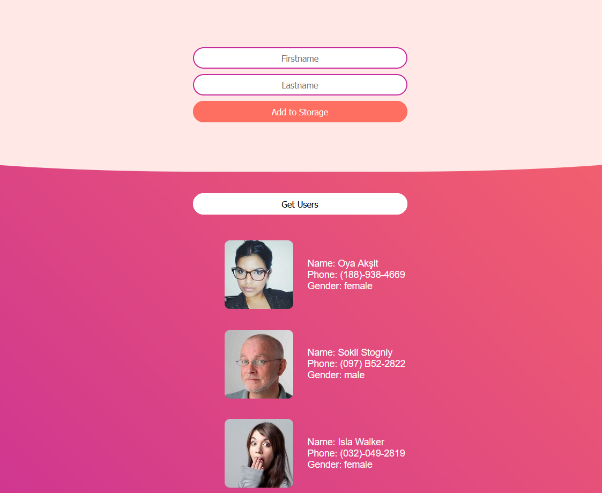

# Random Users

Adding to local storage and getting random users.

## Folder Structure

<b>dist</b> folder is for usage. It contains files to avoid hastle during usage.

<b>src</b> folder contains separate files for source code and further tweaking.

## Browser Compatibility

All of the latest versions of <b>Chrome</b>, <b>Firefox</b>, <b>Edge</b> and <b>Opera</b> browsers are supported.

## Installation

#### Steps to install

<ol>
  <li>download the folder/git clone the repo</li>
  <li>cd root directory of the folder</li>
  <li>npm install</li>
  <li>gulp</li>
  <li>access localhost:5500 on your browser</li>
</ol>

## Screenshot

Homepage with adding to local storage and getting random users.

See code <a href="https://github.com/veronikagregorec/random-users/tree/main/src/scss">here</a>
